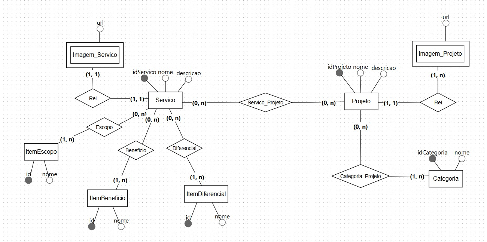
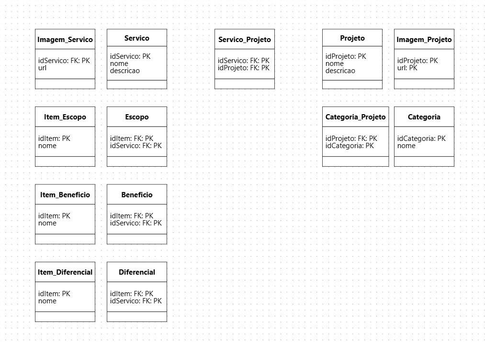

# 🗄️ Banco de Dados — Projeto DUOC

Este documento descreve a **modelagem do banco de dados** do sistema institucional da **DUOC – Arquitetura e Engenharia**, responsável por armazenar e organizar informações relacionadas aos **serviços, projetos, categorias, imagens e conteúdos descritivos** apresentados na plataforma.

A modelagem foi desenvolvida seguindo **boas práticas de Engenharia de Software**, garantindo **normalização, integridade referencial, escalabilidade e rastreabilidade dos requisitos funcionais**.

---

## 📐 Visão Geral da Modelagem

O banco de dados foi estruturado em **duas etapas complementares**:

- **Modelo Conceitual** — representação de alto nível das entidades e seus relacionamentos.
- **Modelo Lógico** — detalhamento das tabelas, chaves primárias (PK) e chaves estrangeiras (FK).

---

## 🧠 Modelo Conceitual

O **Modelo Conceitual** (Figura 1) representa as entidades principais do domínio do sistema DUOC e seus relacionamentos, sem considerar detalhes de implementação física.

📷 **Figura 1 — Modelo Conceitual do Banco de Dados**  

### Entidades Principais

- **Servico**
  - Representa os serviços oferecidos pela DUOC.
  - Atributos principais: `idServico`, `nome`, `descricao`.

- **Projeto**
  - Representa os projetos executados pela empresa.
  - Atributos principais: `idProjeto`, `nome`, `descricao`.

- **Categoria**
  - Classifica os projetos por área ou tipo.
  - Atributos principais: `idCategoria`, `nome`.

- **Imagem_Servico**
  - Armazena imagens associadas a um serviço.
  - Atributo principal: `url`.

- **Imagem_Projeto**
  - Armazena imagens associadas a projetos.
  - Atributo principal: `url`.

- **ItemEscopo**, **ItemBeneficio**, **ItemDiferencial**
  - Representam listas de escopo, benefícios e diferenciais associados a cada serviço.
  - Atributos principais: `id`, `nome`.

### Relacionamentos

- Um **Serviço** pode possuir:
  - Vários itens de escopo
  - Vários benefícios
  - Vários diferenciais
- Um **Serviço** pode estar associado a vários **Projetos** (relação N:N).
- Um **Projeto** pode pertencer a várias **Categorias**.
- Um **Serviço** possui uma imagem associada.
- Um **Projeto** pode possuir uma ou mais imagens.

---

## 🧩 Modelo Lógico

O **Modelo Lógico** (Figura 2) detalha a implementação do banco de dados relacional, apresentando as tabelas, seus atributos e os relacionamentos por meio de chaves primárias e estrangeiras.

📷 **Figura 2 — Modelo Lógico do Banco de Dados**  

---

## 📋 Descrição das Tabelas

### **Servico**
- `idServico` (PK)
- `nome`
- `descricao`

Tabela central que armazena os serviços oferecidos pela DUOC.

---

### **Imagem_Servico**
- `idServico` (PK, FK)
- `url`

Armazena a imagem principal associada a cada serviço.

---

### **Projeto**
- `idProjeto` (PK)
- `nome`
- `descricao`

Armazena os projetos executados pela empresa.

---

### **Imagem_Projeto**
- `idProjeto` (PK, FK)
- `url` (PK)

Permite associar múltiplas imagens a um mesmo projeto.

---

### **Servico_Projeto**
- `idServico` (PK, FK)
- `idProjeto` (PK, FK)

Tabela de associação responsável por implementar o relacionamento **muitos-para-muitos (N:N)** entre serviços e projetos.

---

### **Categoria**
- `idCategoria` (PK)
- `nome`

Armazena as categorias utilizadas para classificar os projetos.

---

### **Categoria_Projeto**
- `idProjeto` (PK, FK)
- `idCategoria` (PK, FK)

Tabela de associação entre projetos e categorias.

---

### **Item_Escopo**
- `idItem` (PK)
- `nome`

Lista de possíveis itens de escopo.

---

### **Escopo**
- `idItem` (PK, FK)
- `idServico` (PK, FK)

Relaciona itens de escopo a um serviço específico.

---

### **Item_Beneficio**
- `idItem` (PK)
- `nome`

Lista de benefícios disponíveis.

---

### **Beneficio**
- `idItem` (PK, FK)
- `idServico` (PK, FK)

Relaciona benefícios a um serviço.

---

### **Item_Diferencial**
- `idItem` (PK)
- `nome`

Lista de diferenciais disponíveis.

---

### **Diferencial**
- `idItem` (PK, FK)
- `idServico` (PK, FK)

Relaciona diferenciais a um serviço.

---

## 🔗 Integridade e Normalização

O modelo:
- Está normalizado até a **3ª Forma Normal (3FN)**.
- Evita redundância de dados.
- Garante integridade referencial por meio de chaves estrangeiras.
- Facilita manutenção, expansão e escalabilidade do sistema.

---

## 🎯 Alinhamento com os Requisitos do Sistema

Este banco de dados atende diretamente aos seguintes objetivos do sistema DUOC:

- Organização estruturada dos serviços e projetos
- Associação clara entre serviços, projetos e categorias
- Suporte à exibição dinâmica de conteúdos no site institucional
- Base sólida para futuras funcionalidades administrativas (CRUD)

---

## ✅ Conclusão

A modelagem apresentada fornece uma **base consistente, escalável e alinhada aos requisitos funcionais** do projeto DUOC, sendo adequada tanto para **uso acadêmico** quanto para **implantação em ambiente de produção**.

As Figuras 1 e 2 (modelo conceitual e lógico) complementam esta documentação, garantindo clareza visual e técnica sobre a estrutura do banco de dados.

---
